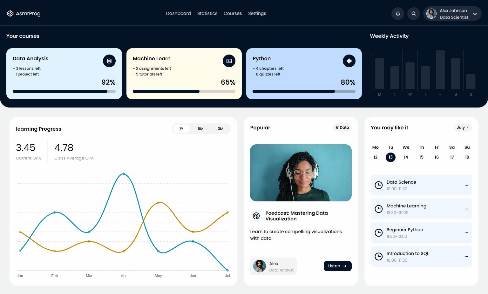

# Responsive Dashboard Design #02
In this tutorial ([Open in Youtube](https://youtu.be/YthqiuzEXBs)), 🎨 We’ll begin by structuring the layout with HTML, then styling it with CSS for a modern, sleek look. Finally, we'll incorporate JavaScript to add interactive features like displaying activity charts!

What You’ll Learn:
- Structuring Your HTML: Laying the foundation for your dashboard with well-organized HTML.
- Styling with CSS: Designing a modern and attractive interface with CSS techniques for layout, colors, and fonts.
- Adding Interactivity with JavaScript: Making the dashboard dynamic and user-friendly.
- Creating a Responsive Design: Ensuring your dashboard looks great on desktops, tablets, and smartphones.
- Custom Components: Building elements like progress bars, charts, and interactive schedules.

Key Features:
- Course Progress Overview: Visualize your progress in different courses with clear, stylish progress bars.
- Learning Progress Chart: Track your learning progress with an interactive graph that shows your current GPA and class average GPA over time.
- Weekly Activity Tracker: Monitor your activity throughout the week with a sleek bar chart.
- Recommendations: Get personalized course recommendations based on your activity and progress.
- Popular Resources: Access popular resources and podcasts to enhance your learning experience.

# Screenshot
Here we have project screenshot :

